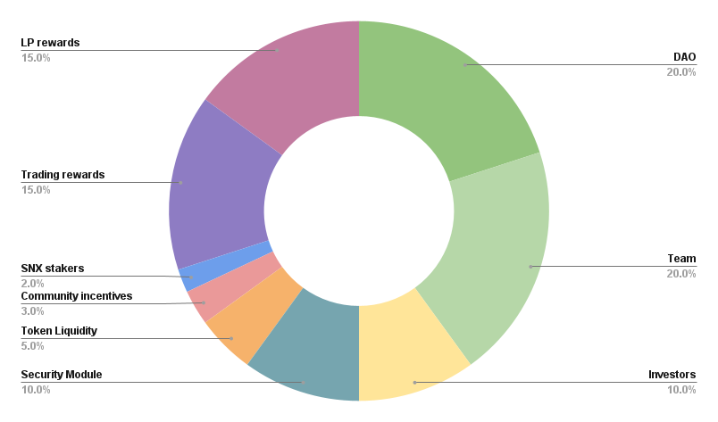

## Simple Summary

This LEAP proposes the distribution of the LYRA token.

## Specification

### 1. DAO (20%)

200,000,000 LYRA are allocated to the LyraDAO. This DAO aims to ensure the ongoing development of the Lyra Protocol and the general growth of the Lyra ecosystem.

### 2. Core Team (20%)

200,000,000 LYRA were allocated to the core team. This is enough to ensure long-term incentive alignment whilst still allowing the community to own the majority of the project.

### 3. Investors (10%)

100,000,000 LYRA were sold to private investors. In early February 2021 when the project was in pre-seed phase, 3.4% of the supply was sold at a $15M FDV. The remaining 6.6% was sold during the seed round in May at a $50M FDV.

### 4. Liquidity Rewards (15%)

150,000,000 LYRA are allocated to liquidity providers. Lyra needs liquidity to facilitate options trading. When options are purchased by traders, collateral must be locked to ensure that the option can be paid out if it expires in the money.

### 5. Trading Rewards (15%)

150,000,000 LYRA are allocated to traders. Trading rewards provide a direct incentive to use Lyra and if implemented effectively, can minimise the fees paid by traders as well as the risks incurred by LPs.

### 6. Security Module (10%)

100,000,000 Lyra are allocated to security module stakers. The Security Module is designed to secure Lyra's traders and liquidity providers in the event that the protocol becomes insolvent and cannot fulfil its obligations. This will become especially important in V2 when positions are not fully collateralized.

### 7. Token Liquidity (5%)

50,000,000 Lyra are allocated to incentivise liquidity in the LYRA token itself, which will help create a healthy market.

### 8. Community Incentives (3%)

30,000,000 Lyra are allocated to as yet unspecified community incentives, to be allocated by the Council via the LEAP framework.

### 9. SNX Stakers (2%)

20,000,000 LYRA are allocated to those who stake SNX on Optimism. This provides a strong incentive for stakers to move over and increase the sUSD supply, which Lyra depends on for trading and LPing.
